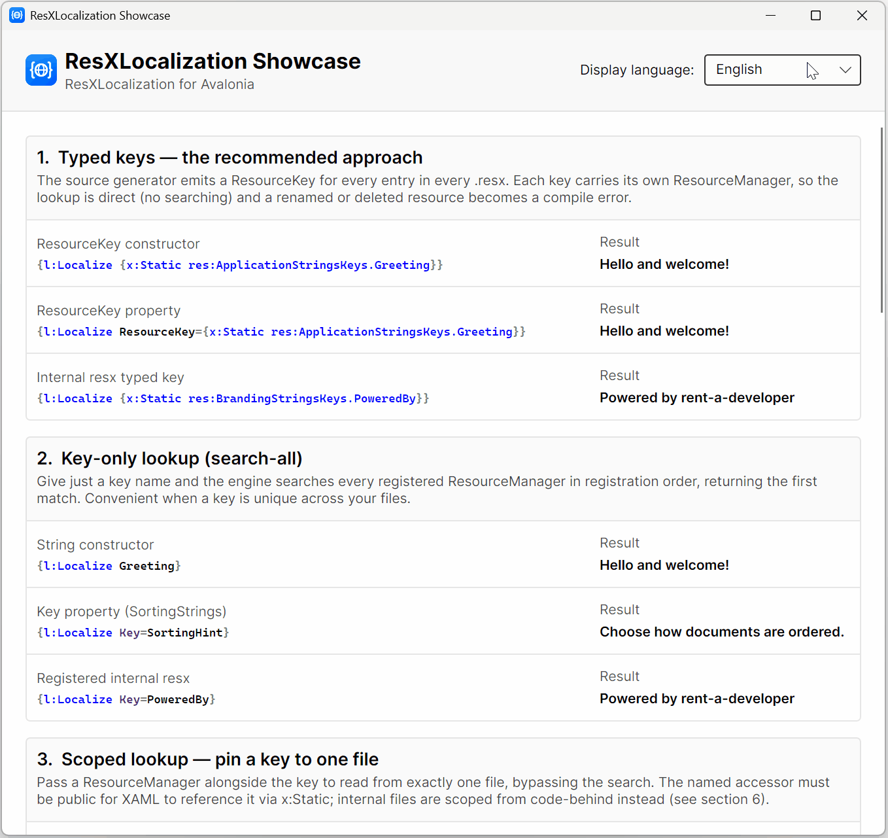

<div align="center">


# ResXLocalization

**Type-safe `.resx` localization for [Avalonia](https://avaloniaui.net/) and [WPF](https://learn.microsoft.com/dotnet/desktop/wpf/) - switch language _live_, write _zero_ csproj boilerplate.**

[](https://github.com/rent-a-developer/ResXLocalization/actions/workflows/ci.yml)
[](https://codecov.io/gh/rent-a-developer/ResXLocalization)
[](https://www.nuget.org/packages/ResXLocalization.Avalonia)
[](https://www.nuget.org/packages/ResXLocalization.WPF)
[](https://dotnet.microsoft.com/)
[](https://learn.microsoft.com/dotnet/core/deploying/native-aot/)
[](https://rent-a-developer.github.io/ResXLocalization/)
[](LICENSE.md)

</div>

---

ResXLocalization gives **Avalonia** and **WPF** apps **type-checked** `.resx` localization that
switches language **instantly** - no window reloads, no reflection.

It takes the `.resx` files you already know and adds **compile-checked keys**, **live language
switching**, and **first-class support for multiple resource files**. One `<PackageReference>`
brings everything: the shared Core engine, the Roslyn source generator, and the MSBuild wiring.

```xml
<!-- Strongly-typed key, generated from your .resx, updates live on every culture switch. -->
<TextBlock Text="{l:Localize {x:Static res:AppStringsKeys.Greeting}}" />
```

```csharp
// Switch the whole UI to German - every bound string re-resolves in place, no reload.
Localizer.Current.CurrentCulture = new CultureInfo("de");
```

<div align="center">
  
  <p><sub>The included sample apps (<a href="samples/ResXLocalization.Avalonia.Sample">Avalonia</a> · <a href="samples/ResXLocalization.WPF.Sample">WPF</a>) - pick a language and every binding updates live, no reload.</sub></p>
</div>

## Highlights

- ⚡ **Live, no-reload language switching** - set one property and every bound string updates in place. No window reload, no view rebuild, no restart.
- 🔒 **Type-safe, compile-checked keys** - a Roslyn source generator turns every `.resx` into strongly-typed keys, so a renamed or deleted resource becomes a **compile error**, not a runtime surprise. Full IntelliSense, too.
- 🧱 **One shared engine, two UIs** - the lookup, culture-switching, and typed-key logic live in a UI-agnostic Core assembly used identically by Avalonia and WPF.
- 🚀 **Native AOT & trim clean (Avalonia)** - zero `IL2026`/`IL3050`, zero reflection over your resources. Publishes with `PublishAot=true` out of the box. *(WPF is Windows-only and does not support Native AOT.)*
- 🗂️ **First-class multiple `.resx`** - register as many resource files as you like; look up by **typed key**, **scope** to one file, or **search across all** with a defined first-match-wins order. Unregister when a plugin unloads.
- 🔤 **Enum localization built in** - localize enum members by convention, both inside `ItemsControl` templates and as bound values.
- 🧮 **Format arguments** - `Get(key, args…)` formats the translation in the active culture.
- 🩺 **Missing-translation diagnostics** - a visible `!key!` sentinel (configurable) plus a `TranslationNotFound` event for logging and coverage reports.
- 🌐 **Language-picker ready** - `GetAvailableCultures()` discovers the cultures your app actually ships.
- 📦 **One package, zero csproj boilerplate** - engine + generator + MSBuild targets ship together. No per-file metadata. Targets **.NET 8 (LTS)** and **.NET 10**.
- 🧩 **MVVM-friendly** - an injectable `ILocalizer` service with `INotifyPropertyChanged`, markup extensions for XAML, and a clean code-behind API.
- 🪶 **Leak-safe** - discarded controls stay collectable (Avalonia uses weak events; WPF binds to the singleton through WPF's own weak binding-target references).

## Two packages, one engine

Install the package for your UI framework. Both share the same UI-agnostic **Core** engine, the same source generator, and the same `.resx` MSBuild wiring - only the XAML markup extensions and binding glue differ.

|                  | **ResXLocalization.Avalonia**                                                           | **ResXLocalization.WPF**                                                      |
| ---------------- | --------------------------------------------------------------------------------------- | ----------------------------------------------------------------------------- |
| **Install for**  | Avalonia apps                                                                           | WPF apps                                                                      |
| **Package**      | [`ResXLocalization.Avalonia`](https://www.nuget.org/packages/ResXLocalization.Avalonia) | [`ResXLocalization.WPF`](https://www.nuget.org/packages/ResXLocalization.WPF) |
| **Targets**      | `net8.0` · `net10.0`                                                                    | `net8.0-windows` · `net10.0-windows`                                          |
| **UI framework** | Avalonia 12 (12.0.5 floor; tested against 12.1.0)                               | WPF (.NET 8+)                                                                 |
| **Dependencies** | Avalonia + `ResXLocalization.Core`                                                     | `ResXLocalization.Core`                                                       |
| **Native AOT**   | ✅ Fully supported                                                                       | ❌ Not supported (WPF limitation)                                              |
| **Platforms**    | cross-platform                                                                          | Windows only                                                                  |

Each package bundles three cooperating pieces - there is nothing else to wire up:

| Piece                | What it does                                                                                                                                                                                   |
| -------------------- | ---------------------------------------------------------------------------------------------------------------------------------------------------------------------------------------------- |
| **Runtime engine**   | The shared `ResXLocalization.Core` (`ILocalizer` / `Localizer.Current`, `ResourceKey`) plus the framework's `{l:Localize}` / `{l:LocalizeEnum}` markup extensions and `LocalizeEnumConverter`. |
| **Source generator** | A Roslyn incremental generator that emits a typed `…Keys` class for every `.resx` (ships as an analyzer; not a runtime dependency).                                                            |
| **MSBuild targets**  | Convention-over-configuration wiring that hands your `.resx` + `.Designer.cs` files to the generator - **no per-file metadata, no manual `AdditionalFiles`**.                                  |

---

## Table of Contents

- [Requirements](#requirements)
- [Installation](#installation)
- [Namespaces](#namespaces)
- [Quick start](#quick-start)
- [Guides and API reference](#guides-and-api-reference)
- [The sample applications](#the-sample-applications)
- [Building from source](#building-from-source)
- [Repository structure](#repository-structure)
- [Versioning](#versioning)
- [Contributing](#contributing)
- [License](#license)
- [Author](#author)

---

## Requirements

- An app targeting **.NET 8** or later (the packages ship `net8.0` and `net10.0` builds).
- The **.NET 8 SDK or later** to build it. The bundled source generator is built against Roslyn 4.8
  (the .NET 8 SDK compiler); see [Production and troubleshooting](#production-and-troubleshooting)
  for `CS9057` and generator troubleshooting.
- For **Avalonia**: **Avalonia 12**. The package keeps a **12.0.5 dependency floor** so XAML still
  compiles under the .NET 8 SDK; samples and tests resolve and verify **12.1.0** on the current SDK.
- For **WPF**: **Windows** (the package targets `net8.0-windows` / `net10.0-windows` with `<UseWPF>true</UseWPF>`).
- A project that uses **`.resx`** resource files with the standard sibling `*.Designer.cs` accessor,
  as generated by Visual Studio's or Rider's classic resx tooling. SDK-only `GenerateResxSource`
  accessors are not eligible; see [Production and troubleshooting](#production-and-troubleshooting).

## Installation

Install the package for your UI framework:

```shell
# Avalonia
dotnet add package ResXLocalization.Avalonia

# WPF
dotnet add package ResXLocalization.WPF
```

…or add the reference directly to your `.csproj`:

```xml
<!-- Avalonia -->
<PackageReference Include="ResXLocalization.Avalonia" />

<!-- WPF -->
<PackageReference Include="ResXLocalization.WPF" />
```

That single reference brings in the **shared runtime engine** (`ResXLocalization.Core`), the **source generator**, and the **MSBuild wiring** that feeds your `.resx` files to the generator. There is nothing else to configure.

A few project properties are recommended. For **Avalonia** (required if you publish with Native AOT):

```xml
<PropertyGroup>
  <!-- The cultures you ship. Each one builds a satellite assembly; required for AOT. -->
  <SatelliteResourceLanguages>en;de</SatelliteResourceLanguages>

  <!-- Lets the analyzers verify AOT-safety on a normal build. -->
  <IsAotCompatible>true</IsAotCompatible>

  <!-- Recommended for Avalonia apps in general. -->
  <AvaloniaUseCompiledBindingsByDefault>true</AvaloniaUseCompiledBindingsByDefault>
</PropertyGroup>
```

For **WPF**, only the cultures you ship are worth declaring (WPF does not support AOT):

```xml
<PropertyGroup>
  <SatelliteResourceLanguages>en;de</SatelliteResourceLanguages>
</PropertyGroup>
```

## Namespaces

The API is split across three namespaces. In C# you almost always need only the first one:

| Namespace                                  | Assembly                    | Contains                                                                       |
| ------------------------------------------ | --------------------------- | ------------------------------------------------------------------------------ |
| `RentADeveloper.ResXLocalization`          | `ResXLocalization.Core`     | `ILocalizer`, `Localizer`, `ResourceKey` - the shared engine                   |
| `RentADeveloper.ResXLocalization.Avalonia` | `ResXLocalization.Avalonia` | Avalonia `LocalizeExtension`, `LocalizeEnumExtension`, `LocalizeEnumConverter` |
| `RentADeveloper.ResXLocalization.WPF`      | `ResXLocalization.WPF`      | WPF `LocalizeExtension`, `LocalizeEnumExtension`, `LocalizeEnumConverter`      |

```csharp
using RentADeveloper.ResXLocalization;   // ILocalizer, Localizer.Current, ResourceKey
```

> [!NOTE]
> The shared types `ILocalizer`, `Localizer`, and `ResourceKey` live in **`RentADeveloper.ResXLocalization`** (the Core assembly), so both the Avalonia and WPF packages share exactly one engine. The framework-specific markup extensions and the converter stay in the `…Avalonia` / `…WPF` namespaces.

## Quick start

### 1. Add your strings

Add a `.resx` file the normal way - for example `Resources/AppStrings.resx` (your neutral/default language) - and a satellite file per culture, e.g. `Resources/AppStrings.de.resx`:

| Key           | `AppStrings.resx` (English) | `AppStrings.de.resx` (German) |
| ------------- | --------------------------- | ----------------------------- |
| `WindowTitle` | `My Application`            | `Meine Anwendung`             |
| `Greeting`    | `Hello and welcome!`        | `Hallo und willkommen!`       |

### 2. Let the generator create typed keys

On every build, the source generator inspects each `.resx` and emits a typed key class named `<FileName>Keys` in the same namespace as your resource file. For `AppStrings.resx` you get:

```csharp
// <auto-generated/>
namespace YourApp.Resources;

public static partial class AppStringsKeys
{
    public static readonly ResourceKey Greeting    = new("Greeting",    AppStrings.ResourceManager);
    public static readonly ResourceKey WindowTitle = new("WindowTitle", AppStrings.ResourceManager);
    // …one ResourceKey per string entry, sorted, with sanitized member names.
}
```

Each `ResourceKey` (from `RentADeveloper.ResXLocalization`) carries **both** the key name and the `ResourceManager` it belongs to - that is what makes typed lookups direct and collision-free.

> [!NOTE]
> Only **string** entries become keys. Binary resources, images, colors, and any entry carrying a `type`/`mimetype` are skipped, and resource names that aren't valid C# identifiers are sanitized into valid member names.

### 3. Register your resources at startup

Register each resource file once, then choose the starting culture.

**Avalonia** (`Program.cs`):

```csharp
using System.Globalization;
using RentADeveloper.ResXLocalization;
using YourApp.Resources;

Localizer.Current.RegisterResourceManager(AppStrings.ResourceManager);
Localizer.Current.CurrentCulture = new CultureInfo("en");
```

**WPF** (`App.xaml.cs`):

```csharp
using System.Globalization;
using System.Windows;
using RentADeveloper.ResXLocalization;
using YourApp.Resources;

public partial class App : Application
{
    protected override void OnStartup(StartupEventArgs e)
    {
        base.OnStartup(e);
        Localizer.Current.RegisterResourceManager(AppStrings.ResourceManager);
        Localizer.Current.CurrentCulture = new CultureInfo("en");
    }
}
```

Registration is only needed for **search-all** lookups; typed and scoped lookups need no registration.

> [!TIP]
> In Avalonia, put the registration (and the initial `CurrentCulture`) inside **`BuildAvaloniaApp()`** rather than `Main`. `BuildAvaloniaApp` runs at runtime *and* under the XAML previewer, so search-all lookups like `{l:Localize Greeting}` resolve at design time too instead of showing the `!Greeting!` sentinel.

### 4. Use it in XAML

Add the namespaces and bind with the `{l:Localize}` markup extension.

**Avalonia:**

```xml
<Window xmlns="https://github.com/avaloniaui"
        xmlns:x="http://schemas.microsoft.com/winfx/2006/xaml"
        xmlns:l="clr-namespace:RentADeveloper.ResXLocalization.Avalonia;assembly=ResXLocalization.Avalonia"
        xmlns:res="clr-namespace:YourApp.Resources"
        Title="{l:Localize {x:Static res:AppStringsKeys.WindowTitle}}">

  <TextBlock Text="{l:Localize {x:Static res:AppStringsKeys.Greeting}}" />

</Window>
```

**WPF:**

```xml
<Window xmlns="http://schemas.microsoft.com/winfx/2006/xaml/presentation"
        xmlns:x="http://schemas.microsoft.com/winfx/2006/xaml"
        xmlns:l="clr-namespace:RentADeveloper.ResXLocalization.WPF;assembly=ResXLocalization.WPF"
        xmlns:res="clr-namespace:YourApp.Resources"
        Title="{l:Localize {x:Static res:AppStringsKeys.WindowTitle}}">

  <TextBlock Text="{l:Localize {x:Static res:AppStringsKeys.Greeting}}" />

</Window>
```

- `xmlns:l` points at the **framework engine** (Avalonia: `assembly=ResXLocalization.Avalonia`; WPF: `assembly=ResXLocalization.WPF`).
- `xmlns:res` points at the namespace of **your** generated keys / resource accessors.

### 5. Switch language - live

```csharp
Localizer.Current.CurrentCulture = new CultureInfo("de");
```

Every `{l:Localize}` binding re-resolves **immediately**. No reload, no flicker.

---

## Guides and API reference

The [generated API reference](https://rent-a-developer.github.io/ResXLocalization/) documents every public type and member. The sections below cover the operational details that go beyond the
quick start.

### Dependency injection

Register the ambient instance so it can be injected as `ILocalizer`:

```csharp
services.AddSingleton<ILocalizer>(_ => Localizer.Current);
```

Alternatively, assign a DI-owned implementation to `Localizer.Current` before creating views. The
property rejects `null`, and the markup extensions always use its current value.

### Lookups and fallback

Prefer generated `ResourceKey` values: they bind a compile-checked name directly to its resource
manager. Scoped string lookups accept a key and manager, while search-all lookups inspect registered
managers in registration order. Enum lookups map values to `Enum_Type_Value` by default and accept a
custom prefix.

Normal .NET `ResourceManager` fallback applies:

| Situation | Result | `TranslationNotFound` |
| --- | --- | --- |
| `de-DE` entry exists | `de-DE` value | No |
| Missing in `de-DE`, exists in `de` | Parent `de` value | No |
| Missing in satellite, exists in neutral resources | Neutral value | No |
| Missing across the complete fallback chain | `!key!` by default | Yes |

`MissingTranslationFormat` changes the sentinel. Because fallback runs first, a key that resolves
from a parent or neutral value does not count as missing - the sentinel and `TranslationNotFound`
report unresolvable keys, not incomplete per-language coverage.

Formatting overloads (`Get(key, args…)`) pass the resolved text and arguments to `String.Format`
using the localizer's current culture.

`Localizer.Current` lives for the whole process, so a strong `CultureChanged` subscription keeps its
subscriber alive. Short-lived subscribers - a view model owned by a window, for example - should
unsubscribe when they are disposed (the sample view models show the pattern).

### Production and troubleshooting

**Native AOT.** Avalonia and Core are Native AOT compatible; WPF does not support Native AOT. Publish
the consuming application with `PublishAot=true` and list shipped cultures in
`SatelliteResourceLanguages` so satellites are retained.

**Avalonia version floor.** The Avalonia package declares 12.0.5 as its minimum while repository
samples and tests use 12.1.0. Avalonia 12.1's XAML generator requires Roslyn 4.14 and cannot load in
the .NET 8 SDK compiler; retaining the lower dependency floor preserves the advertised .NET 8 SDK
consumer path. Applications building with a current SDK resolve Avalonia 12.1 normally.

**Missing generated keys.**

- Ensure the neutral filename is dot-free and a same-folder classic `.Designer.cs` exists.
- Use the .NET 8 SDK or later. An older compiler may reject the Roslyn 4.8 generator with `CS9057`.
- SDK `GenerateResxSource` output lives under `obj` and does not qualify; use
  `PublicResXFileCodeGenerator` or `ResXFileCodeGenerator`.
- `RXLGEN001` identifies malformed eligible `.resx` XML and points at the source file.
- `RXLGEN002` identifies a missing or unrecognized same-folder classic accessor.

**Package topology.** Both UI packages depend on the `ResXLocalization.Core` NuGet package.
Referencing Avalonia and WPF together therefore resolves one deterministic Core version rather than two
embedded copies.

## The sample applications

Two complete, runnable showcases exercise **every** feature and combination - a scrolling window with a live language `ComboBox`:

- **Avalonia:** [`samples/ResXLocalization.Avalonia.Sample`](samples/ResXLocalization.Avalonia.Sample)
- **WPF:** [`samples/ResXLocalization.WPF.Sample`](samples/ResXLocalization.WPF.Sample)

Both demonstrate typed keys (including an internal-accessor file), search-all lookups, scoped lookups, `{l:LocalizeEnum}` in templates (default and custom prefixes, across files), `LocalizeEnumConverter` for bound enum values, and the full code-behind `ILocalizer` API including the `!key!` miss marker.

Run them:

```shell
dotnet run --project samples/ResXLocalization.Avalonia.Sample
dotnet run --project samples/ResXLocalization.WPF.Sample   # Windows only
```

## Building from source

You need the **.NET 10 SDK** (see `global.json`); the produced packages target .NET 8 and .NET 10.

```powershell
# Build everything (must be 0 warnings / 0 errors - warnings are promoted to errors).
dotnet build ResXLocalization.slnx -c Release                # Windows (includes WPF)
dotnet build ResXLocalization.NonWindows.slnf -c Release     # Linux/macOS (skips WPF)
```

See [CONTRIBUTING.md](CONTRIBUTING.md) for running the test suites, packing the NuGet packages, and formatting the code before committing.

## Repository structure

```text
src/
  ResXLocalization.Core/            # shared UI-agnostic engine and transitive NuGet package
  ResXLocalization.SourceGenerators/# the Roslyn key generator (shipped as an analyzer)
  ResXLocalization.Avalonia/        # the Avalonia engine (packable: ResXLocalization.Avalonia)
  ResXLocalization.WPF/             # the WPF engine (packable: ResXLocalization.WPF)
samples/
  ResXLocalization.Avalonia.Sample/ # the Avalonia demo app
  ResXLocalization.WPF.Sample/      # the WPF demo app
tests/
  ResXLocalization.Core.Tests/      # UI-free engine tests, run on net8.0 and net10.0
  ResXLocalization.SourceGenerators.Tests/ # in-memory unit tests for the resx key generator
  ResXLocalization.Avalonia.Sample.Tests/  # headless Avalonia UI tests
  ResXLocalization.WPF.Sample.Tests/       # STA/Dispatcher WPF UI tests
  package-consumption/              # consumers that install the packed .nupkg end to end (CI)
build/
  ResXLocalization.Resx.targets     # the resx -> generator MSBuild wiring (packed per package)
docs/
  docfx.json, index.md, toc.yml     # the DocFX API-reference site (built and deployed by CI)
.github/
  workflows/                        # CI (lint/test/pack/docs/publish/release), CodeQL, dependency review
scripts/
  clean, formatCode, extract-release-notes  # repo maintenance scripts (Windows + POSIX)
Directory.Packages.props            # Central Package Management: every package version lives here
PACKAGE_README.md                   # the short readme shipped inside the NuGet packages
```

`ResXLocalization.Core` is published as the shared transitive dependency of both UI packages. Most
applications install only their UI package; NuGet resolves one Core version even when both UI
packages are referenced.

## Versioning

This project follows [Semantic Versioning](https://semver.org/). See the [CHANGELOG](CHANGELOG.md) for the history of changes.

## Contributing

Contributions are welcome! Please read [CONTRIBUTING.md](CONTRIBUTING.md) first. In short: open an issue to discuss larger changes, keep the build warning-free, update the `CHANGELOG.md`, and make sure the tests pass.

## License

Released under the [MIT License](LICENSE.md). © 2026 David Liebeherr.

Thank you Mike James from AvaloniaUI OÜ for the written permission to use `Avalonia` in the name of the `ResXLocalization.Avalonia` NuGet package.

Avalonia is a registered trademark of AvaloniaUI OÜ. This project is not affiliated with or endorsed by AvaloniaUI OÜ.

## Author

**David Liebeherr** - [rent-a-developer](https://github.com/rent-a-developer)
📧 [info@rent-a-developer.de](mailto:info@rent-a-developer.de)

If this library saves you time, a ⭐ on [GitHub](https://github.com/rent-a-developer/ResXLocalization) is appreciated!
